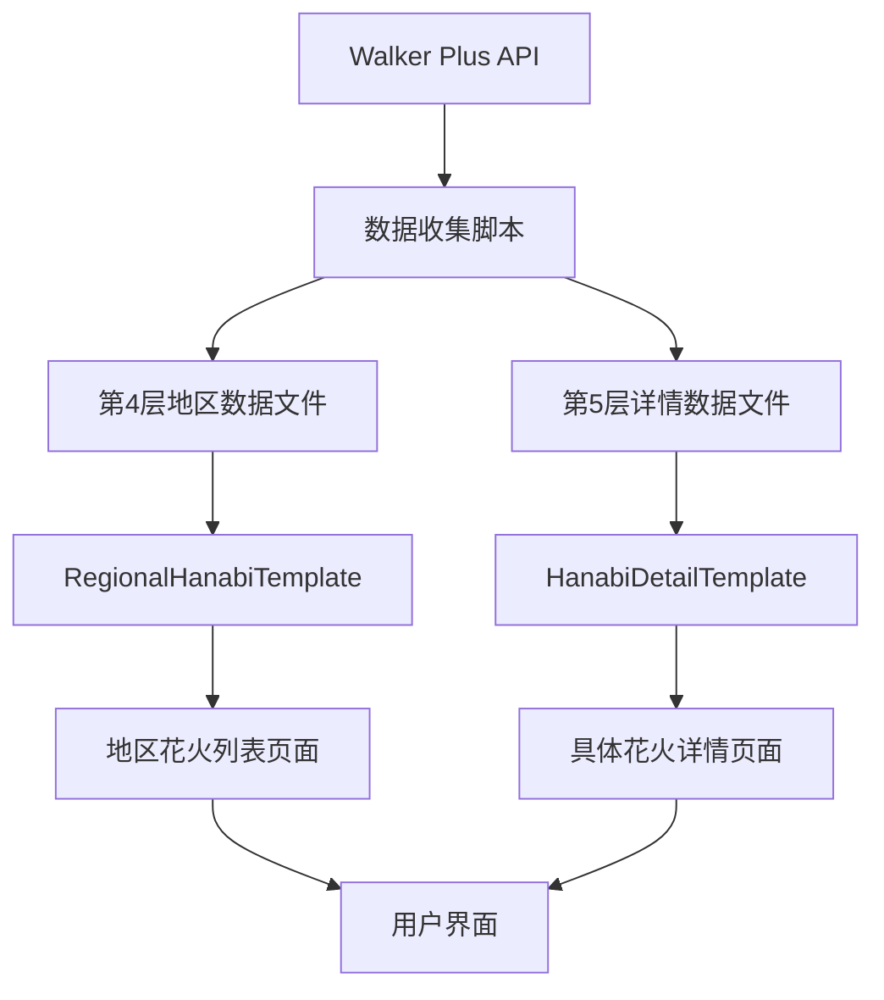
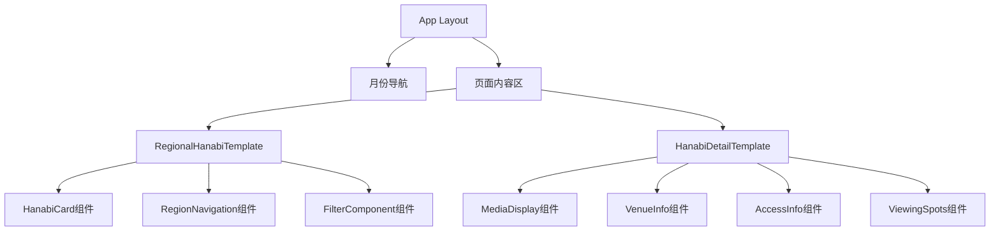
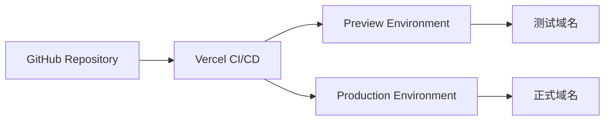

# 🏗️ 技术架构详解

## 🎯 架构设计原则

### 1. 层级分离原则
每一层都有明确的职责，严格按照层级结构进行数据流动和页面导航。

### 2. 组件复用原则
标准化模板确保一致性，降低维护成本。

### 3. 数据驱动原则
所有页面内容都基于结构化数据生成，便于批量管理和更新。

## 📊 数据流架构



## 🧩 组件层级结构



## 🗃️ 数据模型关系

```typescript
// 核心数据模型
interface DataRelationship {
  Level4Data: {
    contains: "HanabiEvent[]"
    links_to: "Level5DetailPages"
    template: "RegionalHanabiTemplate"
  }
  
  Level5Data: {
    extends: "HanabiData"
    includes: "detailed_information"
    template: "HanabiDetailTemplate"
  }
  
  Navigation: {
    breadcrumb: "月份 > 地区 > 具体花火"
    quick_nav: "地区循环导航"
    related: "推荐花火大会"
  }
}
```

## 🎨 样式系统架构

### Tailwind CSS配置
```typescript
// 核心颜色系统
const colorSystem = {
  primary: "blue-500",
  secondary: "rose-400", 
  accent: "purple-300",
  
  backgrounds: [
    "from-rose-100 to-white",
    "from-white to-blue-100", 
    "from-blue-100 to-blue-200"
  ]
}
```

### 响应式断点
```css
/* 移动优先设计 */
mobile: 'default'
tablet: 'md:768px'
desktop: 'lg:1024px'
wide: 'xl:1280px'
```

## 🔄 状态管理

### 客户端状态
- 页面导航状态
- 用户交互状态（点赞、收藏等）
- 视图模式切换（网格/列表）

### 服务端状态
- 花火大会数据
- 地区配置信息
- 导航结构数据

## 🔒 类型安全保障

### TypeScript严格模式
```typescript
// tsconfig.json
{
  "compilerOptions": {
    "strict": true,
    "noImplicitAny": true,
    "noImplicitReturns": true,
    "noUncheckedIndexedAccess": true
  }
}
```

### 运行时验证
```typescript
// 数据验证管道
Walker Plus Data → TypeScript Types → Runtime Validation → UI Components
```

## 📱 性能优化策略

### 代码分割
```typescript
// 页面级别分割
const RegionalPage = lazy(() => import('./RegionalHanabiTemplate'))
const DetailPage = lazy(() => import('./HanabiDetailTemplate'))
```

### 图片优化
```typescript
// 图片处理策略
format: 'SVG优先, PNG备选'
size: '1:1正方形比例'
loading: '懒加载 + 错误处理'
```

### 缓存策略
```typescript
// Next.js自动缓存
static_generation: '第4层和第5层页面'
incremental_regeneration: '支持数据更新'
```

## 🧪 测试架构

### 单元测试
- 组件功能测试
- 数据验证测试
- 工具函数测试

### 集成测试
- 页面导航测试
- 数据流测试
- API集成测试

### E2E测试
- 用户路径测试
- 跨浏览器兼容性
- 响应式布局测试

## 🚀 部署架构

### 推荐部署方案


### 环境配置
```typescript
development: {
  domain: 'localhost:3000',
  api_endpoints: 'development_apis',
  analytics: 'disabled'
}

production: {
  domain: 'your-domain.com',
  api_endpoints: 'production_apis', 
  analytics: 'enabled',
  cdn: 'enabled'
}
```

## 🔧 开发工具链

### 必需工具
- Node.js 18+
- npm/yarn
- Git
- VS Code (推荐)

### 推荐扩展
- TypeScript Hero
- Tailwind CSS IntelliSense
- ES7+ React/Redux snippets
- Auto Rename Tag

## 📋 代码质量保证

### ESLint配置
```json
{
  "extends": [
    "next/core-web-vitals",
    "@typescript-eslint/recommended"
  ],
  "rules": {
    "no-unused-vars": "error",
    "no-console": "warn"
  }
}
```

### Prettier配置
```json
{
  "semi": true,
  "trailingComma": "es5",
  "singleQuote": true,
  "tabWidth": 2
}
```

---

*该文档为技术架构的详细说明，与PROJECT_MASTER_PLAN.md配合使用* 